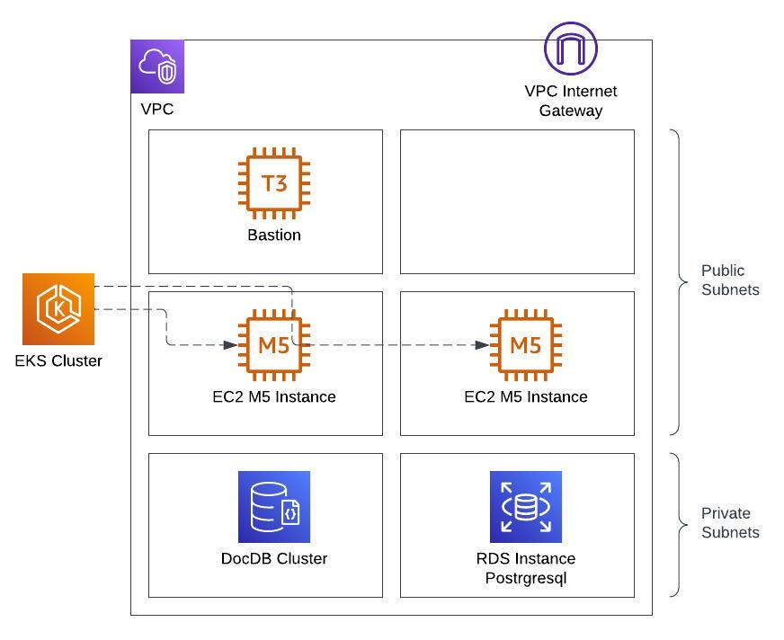

# Karaoke Deploy

## Core Architecture


* some points about
* the architecture of 
* this project

## Terragrunt Folder Structure

```
├── _common
│   └── provider_versions.hcl
├── _env
│   ├── bastion.hcl
│   ├── eks_addons.hcl
│   ├── eks_cluster.hcl
│   ├── namespace.hcl
│   └── vpc.hcl
├── cicd
│   ├── core
│   │   ├── bastion
│   │   │   └── terragrunt.hcl
│   │   ├── eks-addons
│   │   │   └── terragrunt.hcl
│   │   ├── eks-cluster
│   │   │   └── terragrunt.hcl
│   │   ├── namespace
│   │   │   └── terragrunt.hcl
│   │   └── vpc
│   │       └── terragrunt.hcl
│   ├── databases
│   │   ├── dynamodb
│   │   │   └── terragrunt.hcl
│   │   ├── mongo
│   │   │   └── terragrunt.hcl
│   │   └── postgres
│   │       └── terragrunt.hcl
│   ├── ingress
│   │   └── terragrunt.hcl
│   ├── microservices
│   │   ├── rotations
│   │   │   └── terragrunt.hcl
│   │   ├── singers
│   │   │   └── terragrunt.hcl
│   │   └── song-library
│   │       └── terragrunt.hcl
│   ├── migrations
│   │   ├── singers
│   │   │   ├── migrations
│   │   │   │   └── V1__init_db.tftpl
│   │   │   └── terragrunt.hcl
│   │   └── song-library
│   │       ├── migrations
│   │       │   └── init_db.tftpl
│   │       └── terragrunt.hcl
│   └── service-accounts
│       └── terragrunt.hcl
├── dev
│   ├── core
│   │   ├── bastion
│   │   │   └── terragrunt.hcl
│   │   ├── eks-addons
│   │   │   └── terragrunt.hcl
│   │   ├── eks-cluster
│   │   │   └── terragrunt.hcl
│   │   ├── namespace
│   │   │   └── terragrunt.hcl
│   │   └── vpc
│   │       └── terragrunt.hcl
│   ├── databases
│   │   ├── dynamodb
│   │   │   └── terragrunt.hcl
│   │   ├── mongo
│   │   │   └── terragrunt.hcl
│   │   └── postgres
│   │       └── terragrunt.hcl
│   ├── migrations
│   │   ├── singers
│   │   │   ├── migrations
│   │   │   │   ├── create_tables.sql
│   │   │   │   └── init_db.tftpl
│   │   │   └── terragrunt.hcl
│   │   └── song-library
│   │       ├── migrations
│   │       │   └── init_db.tftpl
│   │       └── terragrunt.hcl
│   └── service-accounts
│       └── terragrunt.hcl
|
└── terragrunt.hcl

```